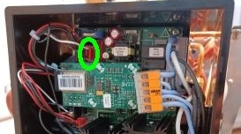

# micra-pro

brew by weight, recipe management, statistics and recipe sharing for la marzocco linea micra

## Implementations

- BLE Access on Linux (Tested on Raspberry Pi 3+ and Raspberry Pi 5)
- Brew Paddle Access via GPIO on Raspberry Pi
- Bookoo Themis Mini Scale API
- Acaia Scales API (Tested with Acaia Lunar pre 2021 and Acaia Pearl)
- Bean Management on SQLite
- History Management on SQLite
- Asset Management with Local Asset Server (setup do be easily implemented remotely)
- Remote Recipe Hub for sharing coffee recipes with PostgreSQL

## Tech Stack

- Local Backend: .Net 8.0
- Local Frontend: Solid-JS
- Asset Server: Nuxt.js
- Recipe Hub: Nuxt.js
- Monorepo Management: Nx

## Build Instructions

### Pre Requisites

- .Net 8.0 SDK installed on Build Machine
- Node.js (Version >= 20) installed on Build Machine

### Needed Environment Variables

#### Backend (apps/backend/.env)

- REMOTE_ASSET_SERVER_PRIVATE_KEY: Private Key for signing Server Access Token (32 characters)

#### Asset Server (apps/asset-server/.env)

- REMOTE_ASSET_SERVER_PRIVATE_KEY: same Private Key as in Backend

### CLI Commands

#### Build Backend

- `npx nx run backend:build` for a local build
  - Output in apps/backend/bin/Debug/net8.0/
- `npx nx run backend:build:production` for production build
  - Output in apps/backend/bin/Release/net8.0/linux-arm64/publish/

#### Build Frontend

- `npx nx run frontend:build`
  - Output in dist/apps/frontend/

#### Build Asset Server

- `npx nx run asset-server:build`
  - Output in apps/asset-server/.output/

#### Run Locally

- `npm run serve`

## Hardware Setup

### Needed Componenets

- Raspberry Pi or other Single Board Computer
- Relais to Switch the Brew Paddle
- Display with Touch Screen

### Brew Paddle Access

To Enable the Brew Paddle, just connect the two pins shown on the picture to your relais and you're good to go.

## Run on Raspberry Pi

0. Deploy Asset Server if you want to use assets (Basic Application works without)
1. Install dotnet runtime
2. Select folders for database and local assets in apps/backend/appsettings.json (Backend Application needs write access)
3. Copy Backend and Frontend Outputs to a selected folder
4. Run local http server (for example lighttpd) for frontend folder on localhost:3000
5. Run local http server for local-asset folder on localhost:3010
6. Set Environment variables for backend
7. Run Backend (cd {your location} && ./MicraPro.Backend)
8. Open Browser in Kiosk Mode on localhost:3000

## Deploy Asset Server on Raspberry Pi

1. Install Node runtime (Version >= 20) on raspberry pi
2. Configure server:

- apps/asset-server/nuxt.config.ts:
  - runtimeConfig.blobStorage.folder: folder on your raspberry pi with access rights for the node server

3. Copy Asset Server output to a selected folder
4. Run node server at your selected location with port 80 (set env variable NITRO_PORT=80, you might need to use authbind or a similar tool)
5. Create a static route in your router for the raspberry pi or add hostname
6. Configure backend to use the static route for the assets

## Implement different Scale

- add your implementation to libs/scale-management/domain/ScaleImplementations/
- add Class that implements the _IScaleConnection_-Interface
- add Class that implements the _IScale_-Interface
- add a new _ScaleImplementation_-object to the _\_scaleImplementations_-List in the Class _ScaleImplementationCollectionService_
